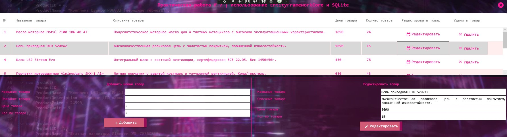

<h1>Приложение для управления товарами</h1>
<h2>WPF-приложение с Entity Framework Core и SQLite</h2>

<h3>Описание проекта</h3>

Приложение для работы с товарами с использованием:

<ul>
    <li>Entity Framework Core - для работы с данными</li>
    <li>SQLite - встроенная база данных</li>
</ul>

<h3>Функциональные возможности</h3>
<ul>
    <li>Добавление новых товаров</li>
    <li>Редактирование существующих товаров</li>
    <li>Удаление товаров из каталога</li>
    <li>Просмотр всего ассортимента</li>
</ul>

<h3>Требования для запуска</h3>
<ul>
    <li>Запустить исполняемый файл: Task7SQLite.exe</li>
</ul>

<h3>Интерфейс приложения</h3>

    

</body>
</html>
